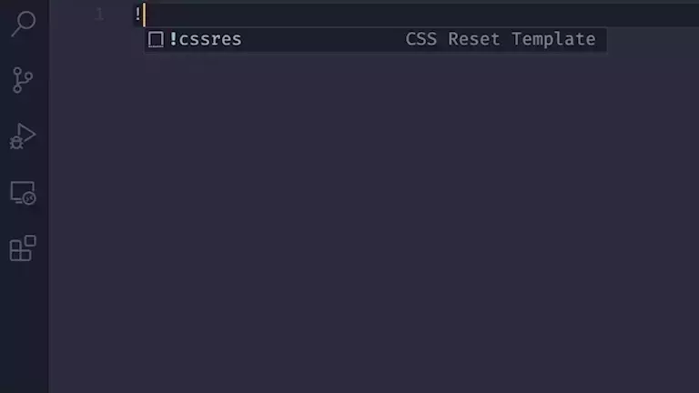

# CSS Reset README

CSS Reset is a simple snippet to reset the default styles of some HTML elements. CSS Reset gives you a clean slate to work with and not have any conflicts with your CSS code.

## How it works

Just type `!cssres` and press `enter`, and the snippet will appear. 

It is recommended that you use the snippet at the beginning of your CSS file. 

## Release Notes

CSS Reset is released.

### 1.0.0
Initial release of CSS Reset

### 1.0.1
Minor adjustments
